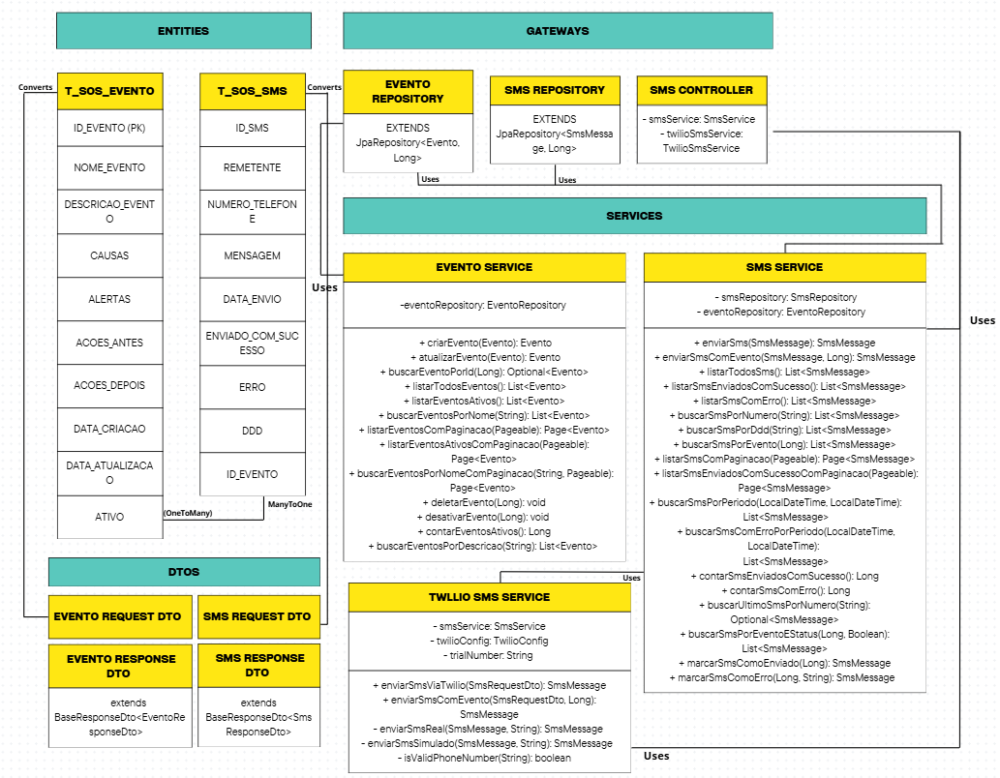
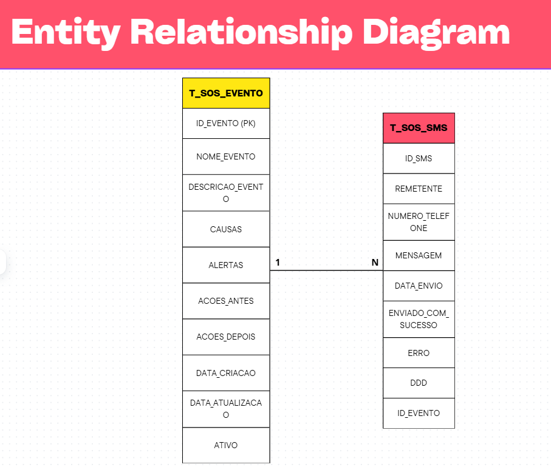

# SOS Localiza - Sistema de Emergência Climática

Sistema de emergência para situações climáticas extremas (enchentes, deslizamentos) que permite envio de SMS de socorro via Twilio e gestão de informações sobre eventos de risco.

## 👥 Integrantes do Grupo

- **Bruno Cantacini** - RM560242 - Desenvolvimento Backend, Arquitetura da Aplicação
- **Amanda Galdino** - RM560066 - Integração Twilio
- **Gustavo Gonçalves** - RM556823 - Documentos, vídeo e diagramas

### Cronograma tarefas:
- https://trello.com/invite/b/68d7339fb360c5bde1caf0dc/ATTI0af812df390890d5b80e5048c67d862a00864906/sos-localiza

## 🎥 Vídeo de Apresentação

🔗 https://www.youtube.com/watch?v=rsRSfEShnGk

*O vídeo apresenta a proposta tecnológica, público-alvo da aplicação e os problemas que a aplicação se propõe a solucionar.*

## 🚀 Tecnologias Utilizadas

- **Java 21**
- **Spring Boot 3.5.6**
- **Spring Data JPA**
- **Spring HATEOAS** (REST Nível 3)
- **H2 Database** (desenvolvimento/testes)
- **Oracle Database** (produção)
- **Twilio SMS API**
- **Lombok**
- **Bean Validation**
- **Maven**

## 📋 Pré-requisitos

- Java 21 ou superior
- Maven 3.6+
- Conta Twilio (para envio de SMS)
- Oracle Database (opcional, para produção)

## ⚙️ Configuração

### 1. Configuração do Twilio (SMS Real)

O sistema suporta **dois modos**:
- **Modo Simulação**: Funciona sem configuração (padrão)
- **Modo Twilio Real**: Envia SMS reais via Twilio

#### Modo Simulação (Padrão)
Sem configurar nada, o sistema usa modo simulação para testes.

#### Modo Twilio Real (Opcional)

Para enviar SMS reais, configure as variáveis de ambiente:

```bash
# Windows PowerShell
$env:TWILIO_ACCOUNT_SID="ACxxxxxxxxxxxxxxxxxxxxxxxxxxxxxxxx"
$env:TWILIO_AUTH_TOKEN="xxxxxxxxxxxxxxxxxxxxxxxxxxxxxxxx"
$env:TWILIO_TRIAL_NUMBER="+15005550006"
$env:TWILIO_ENABLED="true"

# Linux/Mac
export TWILIO_ACCOUNT_SID="ACxxxxxxxxxxxxxxxxxxxxxxxxxxxxxxxx"
export TWILIO_AUTH_TOKEN="xxxxxxxxxxxxxxxxxxxxxxxxxxxxxxxx"
export TWILIO_TRIAL_NUMBER="+15005550006"
export TWILIO_ENABLED="true"
```

**Como obter credenciais Twilio**:
1. Crie conta gratuita em: https://www.twilio.com/try-twilio
2. Receba $15-20 de crédito grátis
3. Obtenha Account SID e Auth Token no Dashboard

📖 **Guia completo**: Consulte [GUIA_TWILIO.md](GUIA_TWILIO.md)

### 2. Configuração do Banco de Dados

#### Oracle FIAP (Padrão)

O projeto está configurado para usar o Oracle FIAP por padrão:

- Host: `oracle.fiap.com.br`
- Porta: `1521`
- SID: `ORCL`
- Usuário: `rm560242`
- Senha: `271005`

#### Desenvolvimento (H2)

Para usar H2 em memória durante desenvolvimento, ative o perfil dev:

```bash
java -jar target/SosLocaliza-0.0.1-SNAPSHOT.jar --spring.profiles.active=dev
```

Acesse o console H2 em:

```
http://localhost:8080/api/h2-console
```

## 🏃‍♂️ Executando o Projeto

### Desenvolvimento

```bash
mvn spring-boot:run
```

### Produção

```bash
mvn clean package
java -jar target/SosLocaliza-0.0.1-SNAPSHOT.jar
```

## 🐳 Deploy com Docker

### Pré-requisitos para Deploy

- Docker instalado
- Docker Compose instalado (ou plugin do Docker)
- Java 21 e Maven (para build local)

### 1. Build Local

```bash
# Compilar o projeto
mvn clean package -DskipTests

# Verificar JAR gerado
ls -lh target/SosLocaliza-0.0.1-SNAPSHOT.jar
```

### 2. Deploy Local com Docker

```bash
# Build da imagem Docker
docker build -t soslocaliza:latest .

# Executar com Docker Compose (background)
docker compose up -d

# Verificar status
docker compose ps

# Ver logs
docker compose logs -f soslocaliza
# Pressione Ctrl+C para sair dos logs

# Parar a aplicação
docker compose down
```

### 3. Deploy na VM (Azure/AWS/GCP)

#### 3.1. Instalação de Dependências na VM

```bash
# Atualizar sistema
sudo apt update
sudo apt upgrade -y

# Instalar Git
sudo apt install git -y

# Instalar Java 21
sudo apt install openjdk-21-jdk -y
java -version

# Configurar JAVA_HOME
echo 'export JAVA_HOME=/usr/lib/jvm/java-21-openjdk-amd64' >> ~/.bashrc
echo 'export PATH=$JAVA_HOME/bin:$PATH' >> ~/.bashrc
source ~/.bashrc

# Instalar Maven
sudo apt install maven -y
mvn -version

# Instalar Docker (script oficial)
curl -fsSL https://get.docker.com -o get-docker.sh
sudo sh get-docker.sh
sudo docker --version
sudo docker compose version

# Adicionar usuário ao grupo docker (opcional)
sudo usermod -aG docker $USER
# NOTA: Use 'sudo' nos comandos docker até fazer logout/login
```

#### 3.2. Clonar e Preparar Repositório

```bash
# Clonar repositório
cd ~
git clone <URL_DO_SEU_REPOSITORIO>
cd OracleSOSLocaliza/SosLocaliza
```

#### 3.3. Build e Deploy na VM

```bash
# Build do JAR
mvn clean package -DskipTests

# Verificar JAR gerado
ls -lh target/SosLocaliza-0.0.1-SNAPSHOT.jar

# Build da imagem Docker
sudo docker build -t soslocaliza:latest .

# Executar com Docker Compose (background)
sudo docker compose up -d

# Verificar status
sudo docker compose ps

# Ver logs (aguarde aparecer "Started SosLocalizaApplication")
sudo docker compose logs -f soslocaliza
# Pressione Ctrl+C para sair dos logs

# IMPORTANTE: Aguarde 30-60 segundos após subir o container antes de testar endpoints
```

#### 3.4. Gerenciamento do Container

```bash
# Parar aplicação
sudo docker compose down

# Reiniciar aplicação
sudo docker compose restart

# Ver logs em tempo real
sudo docker compose logs -f

# Ver status
sudo docker compose ps

# Rebuild e restart
sudo docker compose up -d --build
```

#### 3.5. Configuração de Firewall (Azure)

Se estiver usando Azure VM, configure o Network Security Group (NSG) para permitir tráfego na porta 8081:

1. Acesse o portal Azure
2. Vá em **Network Security Groups**
3. Adicione regra de entrada:
   - **Porta**: 8081
   - **Protocolo**: TCP
   - **Ação**: Allow
   - **Prioridade**: 100

### 4. Verificar Deploy

```bash
# Health Check (local)
curl http://localhost:8081/api/actuator/health

# Health Check (VM - substitua pelo IP público)
curl http://<IP_PUBLICO_VM>:8081/api/actuator/health
```

Resposta esperada:
```json
{"status":"UP"}
```

## 🧪 Testes dos Endpoints

### Base URL

```
http://localhost:8081/api
```

Para VM, substitua `localhost` pelo IP público da VM.

### 1. Health Check

```bash
curl http://localhost:8081/api/actuator/health
```

### 2. Testes de Eventos

#### Criar Evento
```bash
curl -X POST http://localhost:8081/api/eventos/add \
  -H "Content-Type: application/json" \
  -d '{
    "nomeEvento": "Enchente na Região Sul",
    "descricaoEvento": "Alagamento severo em várias ruas",
    "causas": "Chuva intensa",
    "alertas": "Nível do rio subindo",
    "acoesAntes": "Evacuar áreas de risco",
    "acoesDurante": "Não atravessar ruas alagadas",
    "acoesDepois": "Verificar danos estruturais"
  }'
```

#### Listar Eventos
```bash
curl http://localhost:8081/api/eventos/getAll
```

#### Buscar Evento por ID
```bash
curl http://localhost:8081/api/eventos/getById/1
```

#### Atualizar Evento
```bash
curl -X PUT http://localhost:8081/api/eventos/update/1 \
  -H "Content-Type: application/json" \
  -d '{
    "nomeEvento": "Enchente na Região Sul - ATUALIZADO",
    "descricaoEvento": "Alagamento severo atualizado"
  }'
```

#### Deletar Evento
```bash
curl -X DELETE http://localhost:8081/api/eventos/delete/1
```

### 3. Testes de SMS

#### Enviar SMS
```bash
curl -X POST http://localhost:8081/api/sms \
  -H "Content-Type: application/json" \
  -d '{
    "remetente": "Defesa Civil",
    "ddd": "11",
    "numero": "999999999",
    "mensagem": "ALERTA: Enchente na região. Evacue imediatamente!"
  }'
```

#### Listar SMS
```bash
curl http://localhost:8081/api/sms/getAll
```

#### Buscar SMS por Número
```bash
curl "http://localhost:8081/api/sms/buscarPorNumero?numeroTelefone=+5511999999999"
```

### 4. Testes de Procedures (Oracle)

#### Inserir Localização
```bash
curl -X POST http://localhost:8081/api/procedures/localizacao \
  -H "Content-Type: application/json" \
  -d '{
    "nomeLocal": "Praça da Sé",
    "ruaLocal": "Praça da Sé",
    "numeroLocal": 100,
    "cepLocal": "01001000"
  }'
```

#### Atualizar Localização
```bash
curl -X PUT http://localhost:8081/api/procedures/localizacao/1 \
  -H "Content-Type: application/json" \
  -d '{
    "nomeLocal": "Praça da Sé - Atualizado",
    "ruaLocal": "Praça da Sé",
    "numeroLocal": 200,
    "cepLocal": "01001000"
  }'
```

#### Deletar Localização
```bash
curl -X DELETE http://localhost:8081/api/procedures/localizacao/1
```

#### Inserir Usuário
```bash
curl -X POST http://localhost:8081/api/procedures/usuario \
  -H "Content-Type: application/json" \
  -d '{
    "nomeUsuario": "João Silva",
    "cpfUsuario": "12345678901",
    "emailUsuario": "joao@example.com",
    "telefoneUsuario": "11999999999"
  }'
```

#### Atualizar Usuário
```bash
curl -X PUT http://localhost:8081/api/procedures/usuario/1 \
  -H "Content-Type: application/json" \
  -d '{
    "nomeUsuario": "João Silva Santos",
    "cpfUsuario": "12345678901",
    "emailUsuario": "joao.santos@example.com",
    "telefoneUsuario": "11988888888"
  }'
```

#### Deletar Usuário
```bash
curl -X DELETE http://localhost:8081/api/procedures/usuario/1
```

### 5. Sequência Completa de Testes (12 Operações)

Execute esta sequência para testar todas as operações CRUD:

```bash
# LOCALIZAÇÃO - 6 operações
# 1. INSERT 1
curl -X POST http://localhost:8081/api/procedures/localizacao \
  -H "Content-Type: application/json" \
  -d '{"nomeLocal":"Teste 1","ruaLocal":"Rua A","numeroLocal":100,"cepLocal":"12345678"}'

# 2. INSERT 2
curl -X POST http://localhost:8081/api/procedures/localizacao \
  -H "Content-Type: application/json" \
  -d '{"nomeLocal":"Teste 2","ruaLocal":"Rua B","numeroLocal":200,"cepLocal":"87654321"}'

# 3. UPDATE 1 (substitua {id} pelo ID retornado)
curl -X PUT http://localhost:8081/api/procedures/localizacao/{id} \
  -H "Content-Type: application/json" \
  -d '{"nomeLocal":"Teste 1 Atualizado","ruaLocal":"Rua A","numeroLocal":150,"cepLocal":"12345678"}'

# 4. UPDATE 2
curl -X PUT http://localhost:8081/api/procedures/localizacao/{id} \
  -H "Content-Type: application/json" \
  -d '{"nomeLocal":"Teste 2 Atualizado","ruaLocal":"Rua B","numeroLocal":250,"cepLocal":"87654321"}'

# 5. DELETE 1
curl -X DELETE http://localhost:8081/api/procedures/localizacao/{id}

# 6. DELETE 2
curl -X DELETE http://localhost:8081/api/procedures/localizacao/{id}

# USUÁRIO - 6 operações
# 7. INSERT 1
curl -X POST http://localhost:8081/api/procedures/usuario \
  -H "Content-Type: application/json" \
  -d '{"nomeUsuario":"João Silva","cpfUsuario":"12345678901","emailUsuario":"joao@test.com","telefoneUsuario":"11999999999"}'

# 8. INSERT 2
curl -X POST http://localhost:8081/api/procedures/usuario \
  -H "Content-Type: application/json" \
  -d '{"nomeUsuario":"Maria Santos","cpfUsuario":"98765432100","emailUsuario":"maria@test.com","telefoneUsuario":"11888888888"}'

# 9. UPDATE 1
curl -X PUT http://localhost:8081/api/procedures/usuario/{id} \
  -H "Content-Type: application/json" \
  -d '{"nomeUsuario":"João Silva Santos","cpfUsuario":"12345678901","emailUsuario":"joao.santos@test.com","telefoneUsuario":"11977777777"}'

# 10. UPDATE 2
curl -X PUT http://localhost:8081/api/procedures/usuario/{id} \
  -H "Content-Type: application/json" \
  -d '{"nomeUsuario":"Maria Santos Silva","cpfUsuario":"98765432100","emailUsuario":"maria.silva@test.com","telefoneUsuario":"11866666666"}'

# 11. DELETE 1
curl -X DELETE http://localhost:8081/api/procedures/usuario/{id}

# 12. DELETE 2
curl -X DELETE http://localhost:8081/api/procedures/usuario/{id}
```

### 6. Testes com Postman/Insomnia

Para facilitar os testes, você pode importar a coleção de endpoints disponível em [TESTES.md](TESTES.md) ou usar o arquivo [ENDPOINTS_TESTES_DATABASE.txt](ENDPOINTS_TESTES_DATABASE.txt).

### 7. Troubleshooting

#### Aplicação não inicia
```bash
# Verificar logs
sudo docker compose logs -f soslocaliza

# Verificar se a porta está em uso
sudo netstat -tulpn | grep 8081

# Verificar status do container
sudo docker compose ps
```

#### Erro de conexão com banco
- Verifique as credenciais do Oracle no `docker-compose.yml`
- Confirme que a VM tem acesso ao Oracle FIAP
- Teste a conexão: `telnet oracle.fiap.com.br 1521`

#### Erro de permissão Docker
```bash
# Adicionar usuário ao grupo docker
sudo usermod -aG docker $USER

# OU usar sudo temporariamente
sudo docker compose up -d
```

## 🔗 HATEOAS (Hypermedia as the Engine of Application State)

A API implementa **HATEOAS nível 3** do modelo de maturidade REST proposto por Leonard Richardson. Isso significa que todas as respostas incluem links navegáveis que permitem descobrir e acessar recursos relacionados sem precisar conhecer as URLs de antemão.

### O que é HATEOAS?

HATEOAS é um padrão REST que adiciona links nas respostas da API, permitindo que o cliente navegue pela API seguindo links, similar a navegar por um site web. Isso torna a API mais descoberta e evolutiva.

### Nível de Maturidade REST

- ✅ **Nível 1**: Recursos (URLs diferentes para cada recurso)
- ✅ **Nível 2**: Verbos HTTP (GET, POST, PUT, DELETE)
- ✅ **Nível 3**: HATEOAS (Links explícitos nas respostas) ← **Implementado nesta Sprint**

### Estrutura de Resposta com HATEOAS

Todas as respostas de recursos individuais (Evento e SMS) incluem um objeto `_links` com os links disponíveis:

```json
{
  "idEvento": 1,
  "nomeEvento": "Enchente na Região Sul",
  "descricaoEvento": "Alagamento severo em várias ruas",
  "ativo": true,
  "_links": {
    "self": {
      "href": "http://localhost:8080/api/eventos/getById/1"
    },
    "collection": {
      "href": "http://localhost:8080/api/eventos/getAll"
    },
    "update": {
      "href": "http://localhost:8080/api/eventos/update/1"
    },
    "delete": {
      "href": "http://localhost:8080/api/eventos/delete/1"
    },
    "desativar": {
      "href": "http://localhost:8080/api/eventos/desativar/1"
    },
    "sms": {
      "href": "http://localhost:8080/api/sms/buscarPorEvento/1"
    }
  }
}
```

### Links Disponíveis por Recurso

#### Eventos (`EventoResponseDto`)

- `self` - Link para o próprio evento
- `collection` - Link para listar todos os eventos
- `update` - Link para atualizar o evento (PUT)
- `delete` - Link para deletar o evento (DELETE)
- `desativar` - Link para desativar o evento (PATCH)
- `sms` - Link para ver SMSs relacionados ao evento

#### SMS (`SmsResponseDto`)

- `self` - Link para o próprio SMS
- `collection` - Link para listar todos os SMS
- `evento` - Link para o evento relacionado (se houver)

### Exemplo de Uso

1. **Criar um evento**:
   ```bash
   POST /api/eventos/add
   ```
   A resposta incluirá links para navegar pelo evento criado.

2. **Seguir o link `collection`**:
   O cliente pode usar o link `collection` retornado para listar todos os eventos.

3. **Seguir o link `sms`**:
   O cliente pode usar o link `sms` para ver todos os SMSs relacionados ao evento.

### Benefícios

- ✅ **Descoberta automática**: Cliente descobre endpoints disponíveis
- ✅ **Menos hardcoding**: Não precisa decorar URLs
- ✅ **Evolução fácil**: Mudanças de URL são menos impactantes
- ✅ **Navegação natural**: Segue links como em um site web

## 📡 Endpoints da API

### Eventos

- `POST /api/eventos/add` - Criar evento
- `GET /api/eventos/getAll` - Listar eventos (com paginação)
- `GET /api/eventos/getById/{id}` - Buscar evento por ID
- `PUT /api/eventos/update/{id}` - Atualizar evento
- `DELETE /api/eventos/delete/{id}` - Deletar evento
- `PATCH /api/eventos/desativar/{id}` - Desativar evento
- `GET /api/eventos/buscarPorNome?nome=X` - Buscar por nome
- `GET /api/eventos/buscarPorDescricao?descricao=X` - Buscar por descrição
- `GET /api/eventos/estatisticas` - Estatísticas

### SMS

- `POST /api/sms` - Enviar SMS
- `POST /api/sms/emergencia/{idEvento}` - Enviar SMS de emergência
- `GET /api/sms/getAll` - Listar SMS (com paginação)
- `GET /api/sms/buscarPorNumero?numeroTelefone=X` - Buscar por número
- `GET /api/sms/buscarPorDdd?ddd=XX` - Buscar por DDD
- `GET /api/sms/buscarPorEvento/{idEvento}` - Buscar por evento
- `GET /api/sms/buscarPorPeriodo?dataInicio=X&dataFim=Y` - Buscar por período
- `GET /api/sms/ultimoSms/{numero}` - Último SMS por número
- `GET /api/sms/estatisticas` - Estatísticas
- `PATCH /api/sms/marcarSucesso/{id}` - Marcar como sucesso
- `PATCH /api/sms/marcarErro/{id}?erro=X` - Marcar como erro

## 🧪 Testando com Postman/Insomnia

### Exemplo de Criação de Evento

```json
POST /api/eventos/add
Content-Type: application/json

{
  "nomeEvento": "Enchente na Região Sul",
  "descricaoEvento": "Alagamento severo em várias ruas",
  "causas": "Chuva intensa e sistema de drenagem inadequado",
  "alertas": "Nível do rio subindo rapidamente",
  "acoesAntes": "Evacuar áreas de risco",
  "acoesDurante": "Não atravessar ruas alagadas",
  "acoesDepois": "Verificar danos estruturais"
}
```

### Exemplo de Envio de SMS

```json
POST /api/sms
Content-Type: application/json

{
  "remetente": "Defesa Civil",
  "ddd": "11",
  "numero": "999999999",
  "mensagem": "ALERTA: Enchente na região. Evacue imediatamente!"
}
```

### Exemplo de SMS de Emergência

```json
POST /api/sms/emergencia/{idEvento}
Content-Type: application/json

{
  "remetente": "Sistema SOS Localiza",
  "ddd": "11",
  "numero": "999999999",
  "mensagem": "Situação crítica detectada!"
}
```

## 📊 Diagramas da Aplicação

### Diagrama de Classes



### Diagrama de Entidade e Relacionamento (DER)



## 📊 Estrutura do Banco de Dados

### T_SOS_EVENTO

- ID_EVENTO (UUID)
- NOME_EVENTO (VARCHAR 100)
- DESCRICAO_EVENTO (VARCHAR 500)
- CAUSAS (VARCHAR 300)
- ALERTAS (VARCHAR 300)
- ACOES_ANTES (VARCHAR 500)
- ACOES_DURANTE (VARCHAR 500)
- ACOES_DEPOIS (VARCHAR 500)
- DATA_CRIACAO (TIMESTAMP)
- DATA_ATUALIZACAO (TIMESTAMP)
- ATIVO (BOOLEAN)

### T_SOS_SMS

- ID_SMS (UUID)
- REMETENTE (VARCHAR 100)
- NUMERO_TELEFONE (VARCHAR 20)
- DDD (VARCHAR 3)
- NUMERO (VARCHAR 10)
- MENSAGEM (VARCHAR 1000)
- DATA_ENVIO (TIMESTAMP)
- ENVIADO_COM_SUCESSO (BOOLEAN)
- ERRO (VARCHAR 500)
- ID_EVENTO (UUID, FK)

## 🔧 Configurações Avançadas

### Logs

O projeto está configurado para logs detalhados em desenvolvimento:

- SQL queries
- Parâmetros de binding
- Requests HTTP
- Logs do Twilio

### Paginação

Todos os endpoints de listagem suportam paginação:

- `page`: Número da página (padrão: 0)
- `size`: Tamanho da página (padrão: 10)
- `direction`: Direção da ordenação (ASC/DESC)

### Validações

- Números de telefone brasileiros (DDD + 8-9 dígitos)
- Campos obrigatórios
- Tamanhos máximos de campos
- Formato de datas

## 📚 Documentação Adicional

- **[TESTES.md](TESTES.md)**: Instruções detalhadas sobre como testar a API
- **[ENDPOINTS_TESTES_DATABASE.txt](ENDPOINTS_TESTES_DATABASE.txt)**: Endpoints para testes das procedures Oracle
